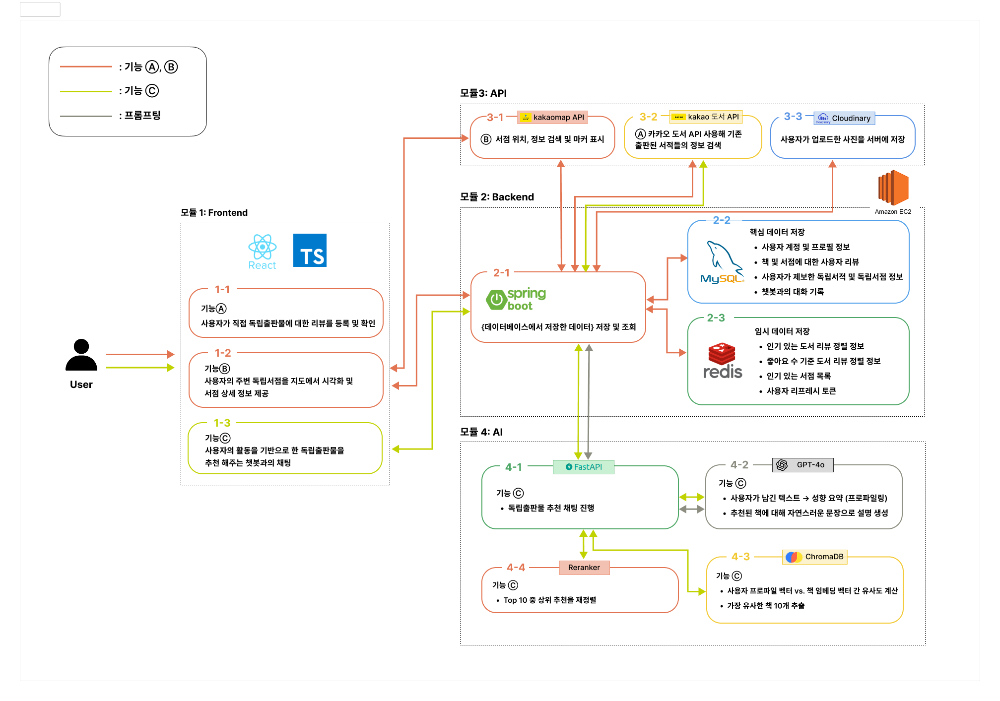

# 서점ZIP


## 프로젝트 개요

이 프로젝트는 개인만의 특성을 드러내는 독립출판물의 감성을 즐기는 사용자가 독립출판물을 더 잘 찾아낼 수 있도록, 독립출판물을 비치한 서점에 대한 위치, 키워드, 운영시간 등의 정보와 도서출판전산망에 등록되지 않은 독립출판물 리뷰 제공 및 추천 시스템을 제공합니다.

### 주요 기능


1. **BOOKSNAP** (사용자 리뷰 기반 독립출판물 데이터 구축)

   - 사용자가 직접 독립출판물에 대한 리뷰를 등록 (책 제목, 작가, 평점, 서점 사진 등)
   - 사용자 참여 기반 데이터를 구축하여 독립출판물 정보를 확보
   - 축적된 리뷰 데이터를 활용하여 추천 시스템 학습 데이터로 활용 가능

2. **서점 ZIP** (지도 기반 서점 탐색)
   - 사용자의 현재 위치 또는 검색 위치를 기준으로 주변 독립서점을 지도에서 시각화
   - Kakao 지도 API 및 거리 계산 알고리즘을 활용하여 위치 기반 필터링, 태그 기반 분류 지원
   - 서점별 보유 도서, 운영 시간, 태그 정보 등 상세 정보 제공
3. **Bookie** (RAG 기반 독립출판물 추천)

- LLM + Vector DB를 활용한 RAG 기반 AI 추천 시스템
- 사용자 리뷰, 검색, 찜 목록 등의 활동 데이터를 바탕으로 개인화된 독립출판물 추천
- 챗봇 인터페이스를 통해 직관적인 추천 경험 제공

### 부가 기능


### 사용 기술


---

## 시작하기

### 사전준비

프론트를 실행하기 전에 서버 실행이 선행되어야 합니다. <br>
서버 실행관련한 깃헙 레포를 첨부합니다.

- 백앤드

```
https://github.com/TEAM-ZIP/Backend
```

- AI

```
https://github.com/TEAM-ZIP/AI
```

### How to Install

<br>
1. Repository 클론

```
git clone https://github.com/TEAM-ZIP/Frontend
cd Frontend
```

 <br>
 2. 의존성 설치
 
 ```
npm install
 ```
- git clone을 하면 의존성 패키지들이 없기 때문에 설치가 필요합니다. 
- npm이 있는 폴더에서 npm i 를 진행해야합니다.
- 설치 완료 시 node_modules 폴더가 생성됩니다.

 <br>
3. 개발 서버 실행

```
npm run dev
```

- 터미널에서 npm run dev를 실행하면 개발 서버가 실행되고 브라우저에서 확인할 수 있습니다. <br>

### How to Build (Production)

<br>

```
npm run build
```

- 배포용 빌드 파일이 dist 폴더에 생성됩니다.

### How to Test

<br>
1. 로컬 환경에서 테스트:

```
npm run build
```

- 개발 서버 실행 후 http://localhost:5173에서 기능 테스트 가능

<br>
2. 배포된 사이트에서 테스트:

- [서점 ZIP가기](https://reactjs.org/)에서 모든 기능 확인 가능

---

## 👋🏻 Members

|  |
| :-------------------------------------------------------: |
|         [강다형](https://github.com/yongaricode)          |

## 📍 아키텍처



## 🗂️ 폴더 구조

```

📂 BookstoreZIP/
│
├─ 📂 public ▶️ Static assets (favicon, images, etc.)
│
├─ 📂 src ▶️ Source code
│   ├─ 📂 api ▶️ API communication files
│   ├─ 📂 assets ▶️ Images, icons and resources
│   ├─ 📂 components ▶️ Reusable React components
│   ├─ 📂 pages ▶️ Page components
│   ├─ 📂 routes ▶️ Routing configuration
│   ├─ 📂 style ▶️ Global styles
│   ├─ App.tsx ▶️ Main App component
│   └─ main.tsx ▶️ Application entry point
│
├─ dist/ ▶️ Built files (for deployment)
│
└─ package.json ▶️ Project configuration and dependencies

```

<br>

## 📚 오픈소스

## Frontend Libraries & Tools

1. **React**: [React Official Site](https://reactjs.org/)
2. **Axios**: [Axios Official Site](https://axios-http.com/)
3. **TailwindCSS**: [TailwindCSS Official Site](https://tailwindcss.com/)
4. **Prettier**: [Prettier Official Site](https://prettier.io/)
5. **Zustand**: [Zustand Offilcial Site](https://zustand-demo.pmnd.rs/)
